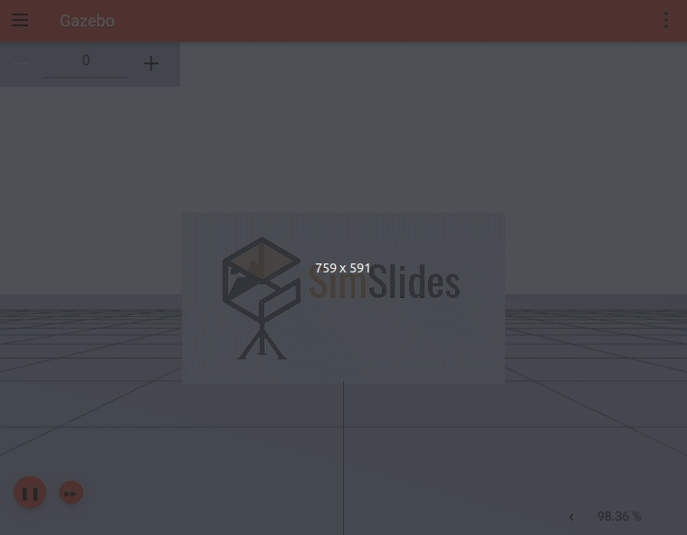
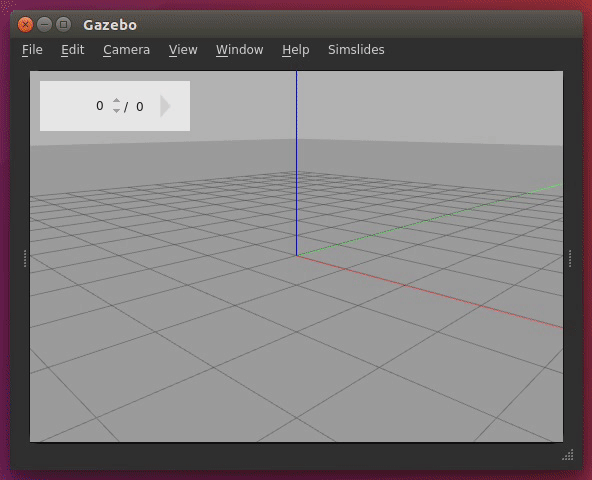

## This branch only works with Ignition Fortress. For Gazebo 11 and Ignition Citadel, see the `main` branch.

---

# SimSlides

Import PDF files into robot simulation and present flying from slide to slide.

## Features

SimSlides consists of plugins for two simulators:
[Gazebo Classic](http://gazebosim.org/) and
[Ignition Gazebo](https://ignitionrobotics.org/). There are different features for
each simulator.

### Ignition

* Navigate through keyframes using **mouse**, **keyboard** or wireless **presenter**
* Keyframes can:
    * Look at a **slide** (even if it has moved)
    * **Move camera** to a specific pose
    * Go through slides **stacked** on the same pose
* ... plus all **Ignition** features!

### Gazebo classic

* Import **PDF** files into simulation through the GUI
* Navigate through keyframes using **mouse**, **keyboard** or wireless **presenter**
* Keyframes can:
    * Look at a **slide** (even if it has moved)
    * **Move camera** to a specific pose
    * Seek to specific spot in a **log** file
    * Go through slides **stacked** on the same pose
    * Write copiable HTML **text** to a dialog
* ... plus all **Gazebo** features!

---

Checking out a couple other tutorials is also recommended if you want to
use each simulator's potential to customize your presentations. Maybe you
want to setup keyboard triggers? Control a robot using
[ROS](https://www.ros.org/)? The possibilities are endless!

## Install

SimSlides' main branch supports both Gazebo Classic and Ignition. It's ok if
you don't have both simulators installed, only the plugin for the simulator
present will be compiled.

### Ignition

The main branch has been tested on Ignition Fortress.

Follow the official install [instructions](https://ignitionrobotics.org/docs/fortress/install).

### Gazebo Classic (doesn't work on this branch)

## Build SimSlides

    mkdir build
    cd build
    cmake ..
    make
    sudo make install
    cd ..

## Run SimSlides

### Ignition

Run simslides:

    simslides_ignition

### Gazebo Classic (doesn't work on this branch)

## Demo

You can find a demo presentation inside the `worlds` directory.
The same demo works for both simulators.

Run it as follows:

1. Move to the simslides clone directory

        cd <path to> simslides

1. Load the world

        simslides_ignition worlds/demo_slide.sdf

## Your own presentation

You can generate your own presentation as follows:

### Generate a new presentation

1. On the top menu, choose `SimSlides -> Import` PDF (or press `F2`)

1. Choose a PDF file from your computer

1. Choose the folder to save the generated slide models at

1. Choose a prefix for your model names, they will be named `prefix-0`, `prefix-1`, ...

1. Click Generate. A model will be created for each page of your PDF. This
may take a while, the screen goes black... But it works in the end.
Sometimes it looks like not all pages of the PDF become models... That's
an open issue.

1. When it's done, all slides will show up on the world in a grid.

1. A world file is also created, so you can reload that any time.

### Presentation mode

Once you have the slides loaded into the world, present as follows:

1. Press `F5` or the play button on the top left to start presentation mode

1. Press the arrow keys to go back and forth on the slides

1. You're free to use the rest of Gazebo's interface while presenting.
   If you've navigated far away from the current slide, you can press `F1`
   to return to it.

1. At any moment, you can press `F6` to return to the initial camera pose.

## Existing presentations

When this project was started, all presentations were kept in different
branches of the same repository. Since mid 2019, new presentations are being
created in their own repositories.

### Until mid 2019

1. Move to the presentation branch, available ones are:

    * `CppCon2015`: [CppCon, September 2015](https://www.youtube.com/watch?v=PXdQwFSJwQ8)

    * `BuenosAires_Nov2015`: University of Buenos Aires, November 2015

    * `Chile_Nov2015`: Universidad de Chile, November 2015

    * `IEEE_WiE_ILC_2016`: [IEEE Women in Engineering International Leadership Conference, May 2016](https://www.youtube.com/watch?v=gTLYT881oao)

    * `ROSCon_Oct2016`: [ROSCon, October 2016](https://vimeo.com/187699565)

    * `ROSIndustrial_Jan2017`: [ROS Industrial web meeting, January 2017](https://www.youtube.com/watch?v=qOhfEweo7V8)

    * `OSS4DM_Mar2017`: [Open Source Software for Decision Making, March 2017](https://www.youtube.com/watch?v=7PsKBUaddDU)

    * `OSCON_May2017`: [Open Source Conference, May 2017](https://www.youtube.com/watch?v=Xj026G6rNvE)

    * `ROSCon_Sep2017`: [ROSCon, Sep 2017](https://vimeo.com/236482055)

    * `Brasil_Mar2018`: Brasil visits, Mar 2018

    * `QConSF_Nov2018`: [QConSF, Nov 2018](https://www.youtube.com/watch?v=Gwbk6Qf_TqY)

    * `UCSC_Feb2019`: University of California, Santa Cruz, Feb 2019

    * `QConAI_Apr2019`: [QCon.ai, Apr 2019](https://www.infoq.com/presentations/robot-simulation-real-world/)

1. A lot changes from one presentation to the next. Follow instructions on that
branch's `README` to run the presentation. I've done my best to document it all,
but each presentation may take some massaging to work years later.

### Since mid 2019

See each repository:

* [ROSConJP 2019](https://github.com/chapulina/rosconjp_2019)
* [ROSCon 2019](https://github.com/chapulina/roscon_gz_ros2/)

## History

This project started as a few bash scripts for CppCon 2015. Back then, it used
to be hosted on BitBucket using Mercurial.

Over the years, the project evolved into more handy GUI plugins, and is
gaining more features for each presentation.

The repository was ported to GitHub + Git in August 2019, when BitBucket
dropped Mercurial support.

